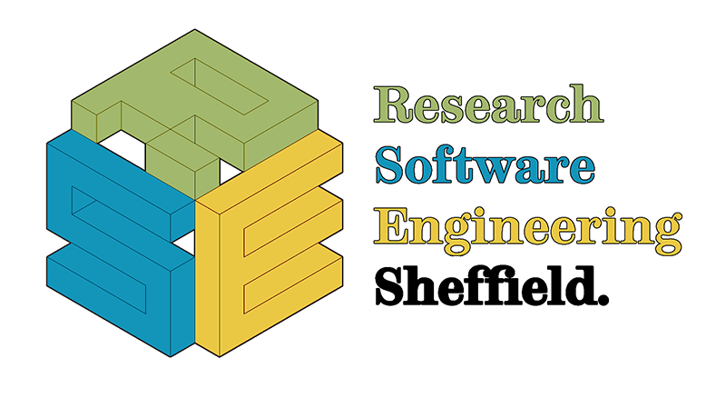

---
output:
  html_document:
    toc: true
toc_float:
      collapsed: false
editor_options: 
  chunk_output_type: console
---

```{r setup, include=FALSE}
knitr::opts_chunk$set(
	echo = TRUE,
	message = FALSE,
	warning = FALSE
)
```


<div class='row'>

<div class="col-md-4 align-self-center">

<center>



</center>


</div>

<div class="col-sm-8 align-self-center">

[ORDA](https://www.sheffield.ac.uk/library/rdm/orda) is University of Sheffield's insitutional repository and provides advice and support to researchers on research data management and the hosting of research datasets. ORDA also provides specialist support in the use of interactive data visualisations.

To contact the ORDA team please email us at <rse@sheffield.ac.uk> and we'll get back to you ASAP to arrange a meeting.

</div>

</div>

# Support for Sheffield Researchers

The OxShef project is a collaboration between Oxford and Sheffield to provide advice on using interactive data visualisation for all academics/researchers - independent of their home institution. However, there are a number of hosting services that ORDA provides exclusively for researchers at Sheffield.
